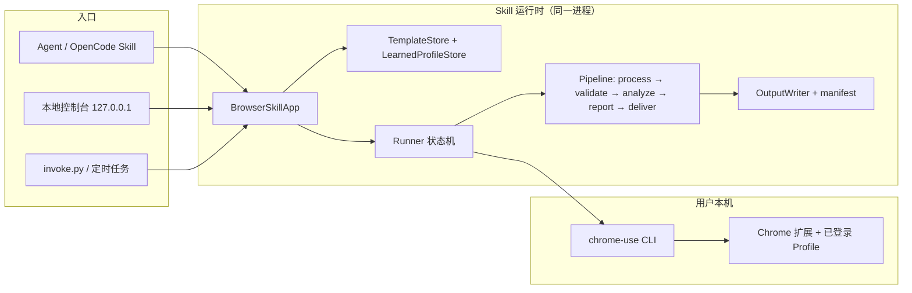

# 方案设计 — Agent + Skill 主入口 · 本地界面 · 本机 Chrome

## 1. 总体架构



**要点**

- 三个入口共享同一个 `BrowserSkillApp.handle(SkillRequest)`，行为一致。
- 界面不是独立服务，而是 Skill 运行时内置的本机 HTTP 控制台（Python 标准库实现）。
- 浏览器 Session 完全在用户本机，未登录则暂停等待用户在 Chrome 完成认证。

## 2. 模块设计

| 模块 | 路径 | 说明 |
|------|------|------|
| 模型 | `models.py` | Template 2.0（processing/analysis/report/delivery）、LearnedProfileDocument、AcquisitionSource |
| 模板存储 | `templates/store.py`, `templates/learned_store.py` | 版本不可变；2.0 的 learned 存 `learned/{version}.yaml` |
| 采集规划 | `acquire/strategies.py` | API→Network→DOM→Browser→Vision 回退链 |
| 执行 | `runtime/runner.py` | 状态机；采集后调用 processing，输出后调用 finalize_pipeline |
| 管线 | `pipeline/process.py`, `report.py`, `deliver.py`, `analyze.py`, `orchestrator.py` | 可插拔阶段 |
| 输出 | `outputs/writer.py`, `outputs/manifest.py` | result / summary / manifest / report.md |
| 控制台 | `console/server.py`, `console/ui.html` | 本机 HTTP API + 单页界面 |
| 入口 | `skill-scripts/invoke.py`, `cli.py` | `ui` 子命令 |
| 定时 | `scripts/windows/Register-ScheduledRun.ps1` | Windows 任务计划注册 |

## 3. 本地控制台设计

### 3.1 安全边界

- 仅监听 `127.0.0.1`，端口默认 `8765`（可指定 / 0 自动）。
- 本机控制台 `console/server.py`：仅绑定 127.0.0.1，无 token（内网单机场景）。
- 文件下载仅允许 `runs/<run_id>/` 内受控路径。
- 不缓存敏感变量；沿用 Runner 的脱敏持久化。

### 3.2 API

| 方法 | 路径 | 作用 |
|------|------|------|
| GET | `/` | 单页界面 |
| GET | `/api/templates?all=1` | 模板列表（含未发布） |
| GET | `/api/templates/{id}` | 模板契约与变量定义 |
| POST | `/api/jobs` | 提交任务 `{action: run|test|resume, selector, run_id, variables}`，后台执行，返回 `job_id` |
| GET | `/api/jobs/{job_id}` | 任务状态与 `SkillResponse` |
| GET | `/api/runs` | 运行历史（summary 汇总） |
| GET | `/api/runs/{run_id}` | summary / manifest / pipeline / 状态 |
| GET | `/api/runs/{run_id}/files/{path}` | 下载制品 |
| GET | `/api/doctor` | 环境诊断 |
| POST | `/api/action` | 通用 `SkillRequest` 透传（Teach：analyze_sample / create / discover / test / publish / repair） |

### 3.3 界面页面

1. **模板** — 卡片 + 变量表单 → 运行；认证暂停时显示「已在 Chrome 登录，继续」按钮。
2. **运行记录** — 列表 + 详情（校验、制品下载、manifest 摘要、pipeline 阶段）。
3. **Teach** — 样例路径 / 草稿 JSON / 发现 / 测试 / 发布的分步表单。
4. **环境** — doctor 输出、CLI 路径、扩展就绪。

## 4. Template 2.0 与 Learned Profile

```yaml
schema_version: "2.0"
template_id: supplier_order_pack
system: { entry_url: https://portal.example.com }
variables: { date: {type: date, required: true, prompt: 日期} }
target:
  record_key: [order_no]
  fields: [...]
  attachments:
    - key: contract
      required: true
      match_by: [order_no]
      filename_pattern: "{order_no}_contract.pdf"
processing:
  enabled: true
  steps:
    - action: coerce_type
      params: { field: amount, type: number }
report:
  enabled: true
  title_pattern: "供应商订单资料包 {date}"
delivery:
  enabled: true
  channels:
    - { type: local, target: "D:/reports/supplier", enabled: true }
    - { type: webhook, target: "https://hooks.internal/notify", enabled: true }
```

Learned Profile 单独存放于 `templates/<id>/learned/<version>.yaml`，Teach / Repair 更新它而不触碰业务契约。

## 5. 执行流程

```text
INPUT_READY → AUTH_CHECK →(未登录) WAIT_USER_AUTH → resume
            → NAVIGATING → EXTRACTING → DOWNLOADING
            → [processing] → VALIDATING → WRITING_OUTPUT
            → finalize_pipeline: analyze → report.md → deliver → pipeline.json
            → COMPLETED / PARTIAL
```

## 6. 触发方式

| 方式 | 实现 |
|------|------|
| Agent | `invoke.py start/run/resume`（执行契约不变） |
| 界面 | `/api/jobs` 后台线程 |
| 定时 | Windows 任务计划调用 `invoke.py run`（用户需保持 Chrome 登录） |
| API / Webhook | 本机控制台 API 已具备；跨机调用留给 Host 平台代理 |

## 7. 分发与部署（本机）

- Skill Hub：`universal-browser-full-*.zip`（含 runtime、templates、scripts、console）。
- chrome-use CLI：自动下载 / `CHROME_USE_BIN` / sidecar / 一键安装器（沿用 v0.1.5）。
- 启动界面：`py scripts\invoke.py ui`（自动打开浏览器）。

## 8. 风险与对策

| 风险 | 对策 |
|------|------|
| 站点改版 | Learned Profile 分离 + Repair 一次自动修复 |
| 本机 Chrome 未登录 | 暂停 + 界面一键续跑 |
| Hub 体积限制 | 界面为单 HTML，无前端构建产物 |
| 并发冲突 | 界面任务队列串行执行浏览器任务 |
| 内网无 GitHub | 制品内网镜像变量 |
